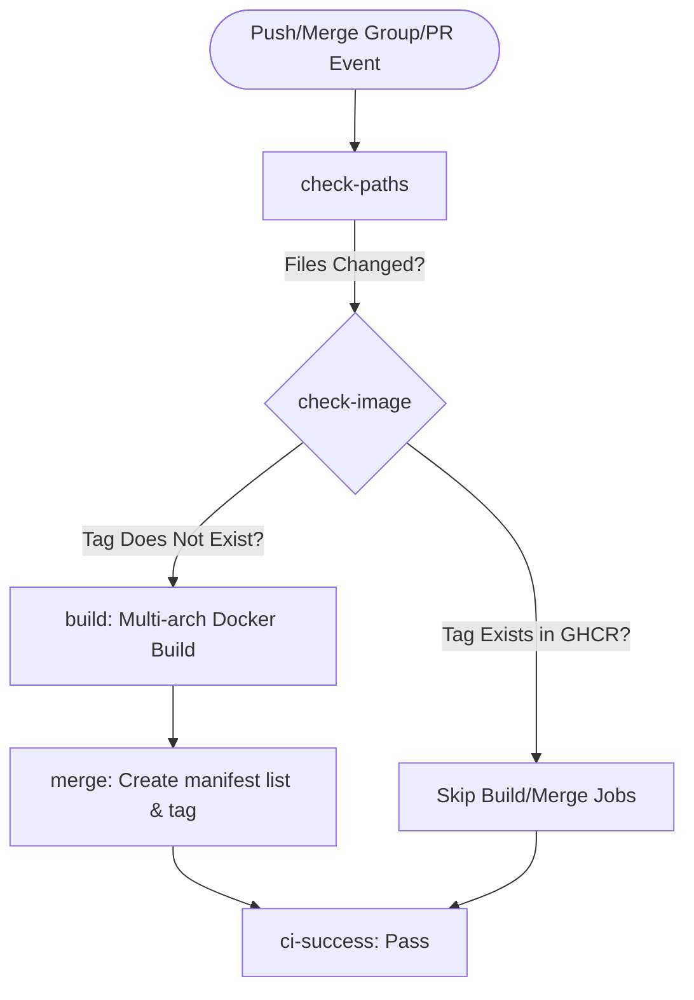
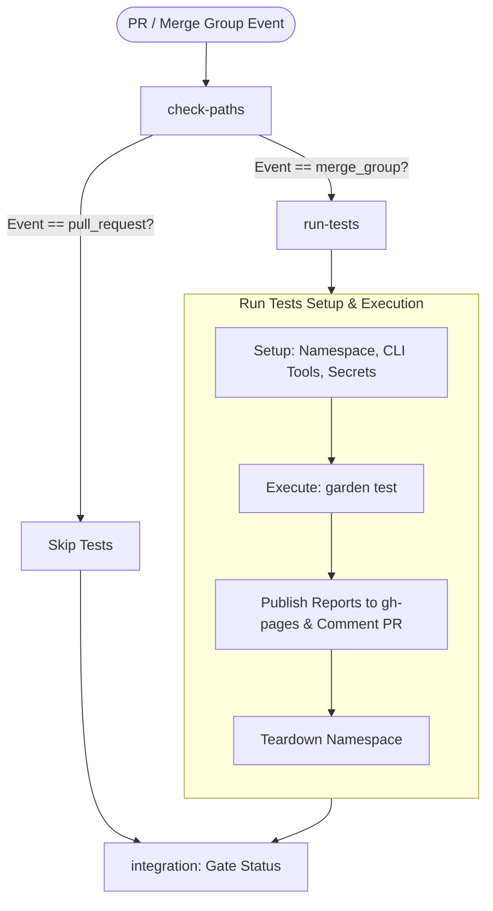

# GitHub Workflows Documentation

This directory contains the workflows that run CI/CD for the Sward Warden repository. The pipeline consists of two main parts:
1. **Docker Image Builds & Publishing** (Backend and Frontend)
2. **Integration Tests**

---

## 1. Docker Image Workflows

* **Backend Workflow:** [sw-be-docker-publish.yml](file:///Users/bengreene/Development/polecatworks/sward-warden/.github/workflows/sw-be-docker-publish.yml)
* **Frontend Workflow:** [sw-fe-docker-publish.yml](file:///Users/bengreene/Development/polecatworks/sward-warden/.github/workflows/sw-fe-docker-publish.yml)

### Triggers
Both workflows are triggered on:
* `push` to the `main` branch.
* `pull_request` targeting `main`.
* `merge_group` targeting `main`.

### Workflow Pipeline Jobs
1. **`check-paths`**: Checks if relevant component files or workflow configurations have changed.
2. **`check-image`** (Skip on `pull_request`):
   * Computes the Git content SHA of the component files (`BACKEND_SHA` / `FE_SHA`).
   * Logs into GitHub Container Registry (GHCR) and queries `docker manifest inspect` for the computed SHA tag: `sha-${CONTENT_SHA}`.
   * If the tag exists in the registry, outputs `exists=true`.
3. **`build`** (Skip on `pull_request` & Skip if Image Exists):
   * Runs only if the paths matched and the image tag does **not** already exist in GHCR.
   * Runs as a multi-arch matrix job for `linux/amd64` and `linux/arm64`.
   * Pushes build digests to GHCR.
   * **Cache Policy:**
     * Always reads cache (`cache-from`) from the `main` branch cache scope to speed up builds.
     * Only writes cache (`cache-to`) when building on the `main` branch, preventing cache clutter and storage waste on merge group queue branches.
4. **`merge`** (Skip on `pull_request` & Skip if Image Exists):
   * Combines the per-platform digests into a multi-arch manifest list using `docker buildx imagetools`.
   * Tags the final manifest with:
     * `sha-${CONTENT_SHA}`
     * `latest` / `main` (if on `main`)
     * `pr-${{ github.event.pull_request.number }}` (if on a PR)
5. **`ci-success`**: Evaluates overall job success, allowing success if the builds were skipped because the image already existed.

### Workflow Logic

---

## 2. Integration Tests Workflow

* **Workflow:** [integration-test.yaml](file:///Users/bengreene/Development/polecatworks/sward-warden/.github/workflows/integration-test.yaml)

### Triggers
* `pull_request` targeting `main`.
* `merge_group` targeting `main`.
* `workflow_dispatch` (Manual trigger).

### Workflow Pipeline Jobs
1. **`check-paths`**: Filters whether relevant backend/frontend files, Helm charts, or integration test scripts have changed.
2. **`run-tests`**: Runs **only on `merge_group`** (or manual triggers) if `check-paths` filters matched.
   * **Setup**:
     * Installs GH CLI, Garden CLI, and Helm.
     * Clones sibling repositories (e.g. `Mfe-shell`).
     * Prepares image tag variables based on the current Git content SHA.
     * Deletes and creates a clean namespace (`sward-warden-pr-${PR_NUMBER}`) inside the Runner's Kubernetes cluster.
     * Installs mock secrets required by the Helm charts.
   * **Execution**:
     * Runs `garden test --env pr` passing the backend and frontend image targets.
     * Copies out Robot Framework HTML test results from the Kubernetes namespace.
   * **Reports**:
     * Publishes the HTML report to the `gh-pages` branch.
     * Adds a comment to the PR referencing the unique test report URL (if run within a PR context).
   * **Teardown**:
     * Runs `garden cleanup namespace` and deletes the Kubernetes namespace.
3. **`integration`**: Final status check to gate the merge queue.

### Workflow Logic

