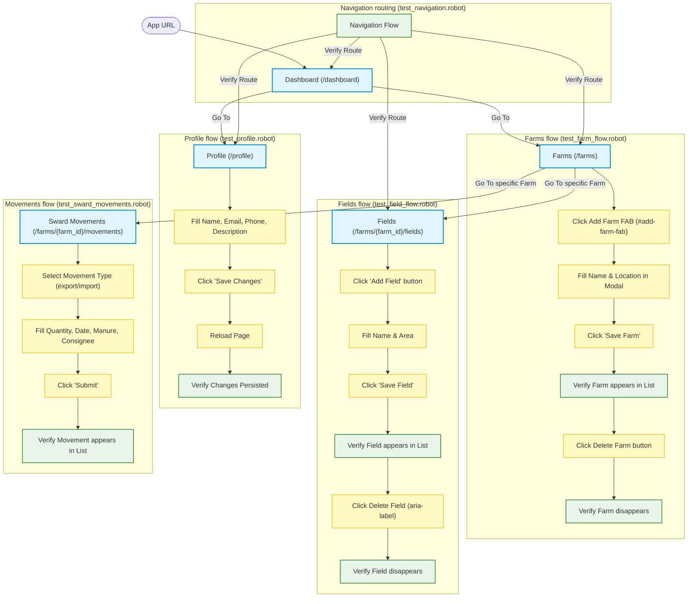

# Sward Warden Integration Tests

This directory contains the integration test suite for Sward Warden, implemented using [Robot Framework](https://robotframework.org/). The tests cover everything from basic service health checks to complex, end-to-end user flows spanning both the Frontend (Angular) and Backend (Rust) components.

## Test Suite Structure

The tests are organized into several logical suites:

| Test Suite File | Type | Description |
| :--- | :--- | :--- |
| [test_be.robot](file:///Users/bengreene/Development/polecatworks/sward-warden/integration-tests/tests/test_be.robot) | API | Direct REST API verification for all BREAD operations (Farms, Fields, Events, Soil Analyses, etc.) |
| [test_fe.robot](file:///Users/bengreene/Development/polecatworks/sward-warden/integration-tests/tests/test_fe.robot) | HTTP | Verifies the Frontend service is running and serving `index.html` |
| [test_external_dns.robot](file:///Users/bengreene/Development/polecatworks/sward-warden/integration-tests/tests/test_external_dns.robot) | Browser | Verification of virtual service and gateway routing via external DNS (K8s only) |
| [test_navigation.robot](file:///Users/bengreene/Development/polecatworks/sward-warden/integration-tests/tests/test_navigation.robot) | Browser | Verifies basic navigation routing within the application UI |
| [test_profile.robot](file:///Users/bengreene/Development/polecatworks/sward-warden/integration-tests/tests/test_profile.robot) | Browser / E2E | Tests editing user profile details and verifies reload persistence |
| [test_farm_flow.robot](file:///Users/bengreene/Development/polecatworks/sward-warden/integration-tests/tests/test_farm_flow.robot) | E2E (UI + API) | End-to-end creation and deletion of farms |
| [test_field_flow.robot](file:///Users/bengreene/Development/polecatworks/sward-warden/integration-tests/tests/test_field_flow.robot) | E2E (UI + API) | End-to-end field creation and deletion under a parent farm |
| [test_sward_movements.robot](file:///Users/bengreene/Development/polecatworks/sward-warden/integration-tests/tests/test_sward_movements.robot) | E2E (UI + API) | End-to-end sward movement registration and API validation |

---

## Test Execution Flows

The integration tests validate the Sward Warden system using three main execution flows: **API-only tests**, **Simple UI tests**, and **Hybrid E2E flows** (which combine browser actions with API verifications to ensure database consistency).

### End-to-End & Integration Flows



---

## Running the Tests

To run the integration tests locally, ensure that the database (`make compose-db`), backend (`make sw-be-dev`), and frontend (`make sw-fe-dev`) are running.

Then, execute the following commands from the root directory:

```bash
# Run the entire integration test suite
make robot-test

# Run only backend API validation tests
make robot-test-be

# Run only frontend HTTP tests
make robot-test-fe

# Run browser navigation tests
make robot-test-nav

# Run additional test flows
make robot-test-hold
```

Test reports and video recordings (if any test fails or completes) will be generated and saved under `integration-tests/reports/`.
