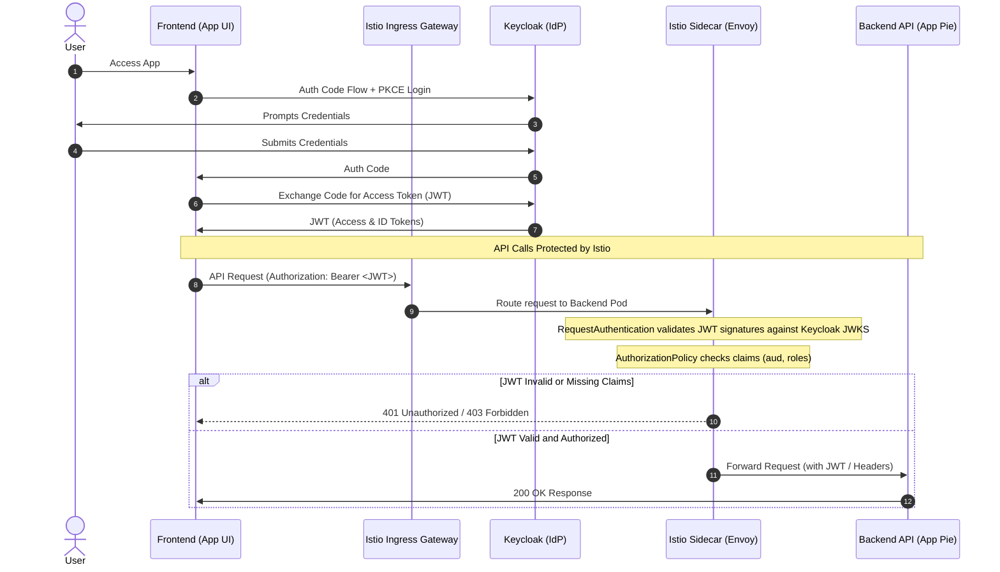

# Analysis: Keycloak & Istio Security Integration

This document analyzes and plans the security integration of Keycloak as the Identity Provider (IdP) and Istio as the service mesh security layer for the SwardWarden application.

## Executive Summary

To transition from the current local development authentication (using in-memory developer-generated JWTs) to a production-grade secure architecture, we will leverage **Keycloak** for user authentication and identity management, and **Istio** for request authentication and policy enforcement at the service mesh layer.

- **Keycloak** will manage realms, clients, roles, users, and issue cryptographically signed JSON Web Tokens (JWTs).
- **Istio** (via `RequestAuthentication` and `AuthorizationPolicy` CRDs) will intercept incoming API calls, validate their signatures against Keycloak's JWKS, and enforce access controls based on token claims before traffic reaches the backend application container.

---

## Architecture & Authentication Flow



### Key Components

1. **Frontend (`sward-warden-fe`)**: A public OpenID Connect (OIDC) client executing Authorization Code Flow with PKCE.
2. **Backend (`sward-warden-be`)**: The API service. Although it does not perform credential exchange directly, it defines client-level scopes and roles (`user`, `viewer`, `support`, `admin`) which are validated against incoming requests.
3. **Istio Ingress Gateway**: Handles ingress TLS termination and routes `/sward` prefix requests to the backend.
4. **Envoy Sidecar**: Co-located with the Backend API pod, enforcing policies locally at the pod boundary.

---

## Naming Conventions & Claims Architecture

To transition from the dummy names (`app-pie`, `app-ui` referenced in the examples) to a structured naming convention, we align the Keycloak configuration with SwardWarden's current database roles (`user`, `support`, `admin`) and backend JWT deserialization logic.

### 1. Client & Realm Naming Conventions

| Component | Target Name | Description |
| :--- | :--- | :--- |
| **Keycloak Realm** | `sw-dev` | The OIDC realm representing the environment. |
| **Frontend Client ID** | `sward-warden-fe` | Public client representing the frontend UI, utilizing Authorization Code Flow with PKCE. |
| **Backend Client ID** | `sward-warden-be` | Confidential/Resource client representing the backend REST API. |
| **Client Scope** | `sward-warden-be-audience` | Custom scope mapping `sward-warden-be` into the JWT's `aud` claim. |

### 2. Role Mappings

We map roles in Keycloak under the `sward-warden-be` client as follows:

* **`admin`**: Full system administration and read/write access.
* **`support`**: Access to read audit logs and view general farm data for diagnostic purposes (write access restricted, except where explicitly permitted).
* **`user`**: Standard tenant access (read/write access to their own farms, fields, and compliance data).
* **`viewer`**: Read-only access to view farms, fields, and records without modification permissions.

### 3. JWT Claims Mapping

The SwardWarden backend auth middleware (defined in [auth.rs](file:///Users/bengreene/Development/polecatworks/sward-warden/sw-be-container/src/webserver/auth.rs)) extracts authorization info using a custom claim:
```rust
let role = claims.custom.sward_roles.first().cloned();
```

To support this claim in Keycloak without writing custom code, we configure a **Protocol Mapper** inside Keycloak for the `sward-warden-fe` client:

1. **Protocol Mapper Configuration:**
   * **Name:** `sward-roles-mapper`
   * **Mapper Type:** `User Client Role`
   * **Client ID:** `sward-warden-be`
   * **Token Claim Name:** `sward_roles`
   * **Claim JSON Type:** `String`
   * **Multivalued:** `true`
   * **Add to Access Token:** `true`
   * **Add to ID Token:** `true`

This guarantees that the issued access token contains the array claim `"sward_roles": ["admin"]` (or other roles), matching the backend's expected structure exactly.

---

## Istio Enforcement Policies

Istio provides native security CRDs to enforce authentication and authorization at the envoy sidecar layer.

### 1. RequestAuthentication

The `RequestAuthentication` resource defines the token validation parameters, specifying how Envoy retrieves the public keys (JWKS) to check signatures.

```yaml
apiVersion: security.istio.io/v1beta1
kind: RequestAuthentication
metadata:
  name: sward-warden-jwt
  namespace: sward-warden-dev
spec:
  selector:
    matchLabels:
      app: sward-warden-be
  jwtRules:
    - issuer: "https://sw-dev.polecatworks.com/auth/realms/sw-dev"
      jwksUri: "https://sw-dev.polecatworks.com/auth/realms/sw-dev/protocol/openid-connect/certs"
      audiences:
        - "sward-warden-be"
      forwardOriginalToken: true
```

### 2. AuthorizationPolicy

The `AuthorizationPolicy` resource defines rules that govern who can access which resources, checking the claims verified by the `RequestAuthentication` policy.

```yaml
apiVersion: security.istio.io/v1beta1
kind: AuthorizationPolicy
metadata:
  name: sward-warden-rbac
  namespace: sward-warden-dev
spec:
  selector:
    matchLabels:
      app: sward-warden-be
  action: ALLOW
  rules:
    # Rule 1: Read operations require user, viewer, support, or admin roles
    - to:
        - operation:
            methods: ["GET", "OPTIONS"]
      from:
        - source:
            requestPrincipals: ["https://sw-dev.polecatworks.com/auth/realms/sw-dev/*"]
      when:
        - key: request.auth.claims[sward_roles]
          values: ["user", "viewer", "support", "admin"]

    # Rule 2: Write operations require admin, support, or user roles (with support restricted based on backend route rules)
    - to:
        - operation:
            methods: ["POST", "PUT", "DELETE", "PATCH"]
      from:
        - source:
            requestPrincipals: ["https://sw-dev.polecatworks.com/auth/realms/sw-dev/*"]
      when:
        - key: request.auth.claims[sward_roles]
          values: ["admin", "support", "user"]
```

---

## User Creation & Management

To create new users using the EDP EPAM Keycloak Operator, you declare them as Kubernetes resources. Here is the configuration for the test users provided in the sample:

### 1. Secret for User Passwords
Define the password secret referenced by the user configurations:

```yaml
apiVersion: v1
kind: Secret
metadata:
  name: keycloak-user-jon-snow
  namespace: sward-warden-dev
type: Opaque
data:
  # Base64-encoded value of "johnsnowpw"
  password: am9obnNub3dwdw==
```

### 2. Test User 1: johnsnow (Read-Only Access)
Mapped to the `DevReaders` group (which grants the `chunks-read` role):

```yaml
apiVersion: v1.edp.epam.com/v1
kind: KeycloakRealmUser
metadata:
  name: dev-user-john-snow
  namespace: sward-warden-dev
spec:
  realmRef:
    name: sw-dev
    kind: KeycloakRealm
  username: johnsnow
  firstName: "John"
  lastName: "Snow"
  email: "john.snow13@example.com"
  enabled: true
  emailVerified: true
  keepResource: true
  roles:
    - offline_access
  groups:
    - DevReaders
  attributes:
    foo: "bar"
    baz: "jazz"
  passwordSecret:
    name: keycloak-user-jon-snow
    key: password
```

### 3. Test User 2: johnsnow2 (Read-Write Access)
Mapped to both `DevReaders` and `DevWriters` groups (which grants both `chunks-read` and `chunks-write` roles):

```yaml
apiVersion: v1.edp.epam.com/v1
kind: KeycloakRealmUser
metadata:
  name: dev-user-john-snow2
  namespace: sward-warden-dev
spec:
  realmRef:
    name: sw-dev
    kind: KeycloakRealm
  username: johnsnow2
  firstName: "John"
  lastName: "Snow2"
  email: "john.snow132@example.com"
  enabled: true
  emailVerified: true
  keepResource: true
  roles:
    - offline_access
  groups:
    - DevReaders
    - DevWriters
  passwordSecret:
    name: keycloak-user-jon-snow
    key: password
```


### Dynamic User Provisioning Options (Production Patterns)

While declaring users as `KeycloakRealmUser` Custom Resources is excellent for setting up static/test accounts (e.g. GitOps-managed admin or system accounts), managing dynamic signups via Kubernetes manifests is an anti-pattern. Here are three recommended production patterns for dynamic user registration:

#### 1. Native Keycloak Self-Registration (Recommended for Simplicity)
Keycloak includes a built-in registration flow out of the box.
* **How it works:** You enable "User registration" in the Realm settings. When a new user visits the site, Keycloak's hosted login screen will display a "Register" link.
* **Auto-Assignment:** We can configure **Default Groups** (such as `DevReaders`) in the Keycloak realm so that every self-registered user automatically receives read access upon sign-up without manual intervention.

#### 2. Programmatic Provisioning via Keycloak Admin API (For Custom Signup UIs)
If you require a custom branded registration form directly inside the SwardWarden frontend app instead of redirecting to Keycloak:
* **How it works:** The Backend API is configured with Keycloak Admin client credentials (Service Account) with permissions to manage users.
* **Process:** The frontend sends a signup payload to a SwardWarden backend endpoint. The backend processes any application-specific validations, then calls the Keycloak Admin API (`POST /admin/realms/{realm}/users`) to provision the user account and group mappings programmatically.

#### 3. Just-In-Time (JIT) Provisioning via Identity Federation
If users should log in using external identity providers (Google, GitHub, Microsoft, or an Enterprise OIDC/SAML provider):
* **How it works:** Keycloak is configured as an Identity Broker.
* **Process:** On first login, Keycloak automatically creates a local user profile (Just-In-Time provisioning) and applies Identity Provider Mappers to map external claims into Keycloak groups and roles dynamically.

To integrate the backend code with the Istio-validated claims, we have two primary architectural options:

### Option A: Envoy Header Injection & Propagation (Recommended for Simplicity)
In this pattern, Istio verifies the JWT. After verification, Istio extracts claims (such as `sub` and roles) and injects them as custom headers (`X-User-ID`, `X-User-Role`) using an EnvoyFilter or AuthorizationPolicy rule.
- **Pros:** The backend application remains unaware of OIDC internals. It only inspects trusted HTTP headers.
- **Cons:** Security relies entirely on the mesh. We must guarantee that the Ingress Gateway strips these headers from external client requests so that clients cannot spoof their user ID and roles.

### Option B: Zero-Trust Token Verification in App (Recommended for Security)
The backend continues to extract the standard `Authorization: Bearer <JWT>` header. In production mode, instead of using the local developer keypair, it fetches the JWKS from Keycloak (and caches the keys) to verify the token signature.
- **Pros:** Defense-in-depth. If Istio is misconfigured, the application is still protected.
- **Cons:** The backend must handle OIDC library complexity, cache JWKS, and handle network requests to Keycloak on startup or during key rotation.

### Recommended Path: Hybrid Approach
For the initial implementation, we should implement **Option B** (configuring the backend to trust a configured production OIDC issuer/JWKS URL) but also allow it to run in **Header Mode** when deployed behind an Istio gateway that handles validation.

---

## Development Considerations

When building and testing this architecture locally, we need to balance security realism with developer productivity.

### 1. Mock Dev Auth vs. Local Keycloak
Currently, SwardWarden supports a mock in-memory developer authentication server (controlled via `debugging.enable_dev_auth: true`).
* **Keep Dev Auth for Fast Feedback loops:** Running Keycloak in a local development cluster can consume significant system resources. Developers should continue to use the mock token generator (`/dev/auth/token`) and `/.well-known/jwks.json` for rapid local iteration on backend logic.
* **Test Runners (e.g., Robot Framework):** Retaining the mock endpoints allows integration testing suites (`make robot-test`) to run reliably and quickly without orchestrating headless browser logins or configuring actual OIDC callbacks.

### 2. Local Service Mesh Configuration (Garden)
In local development via Garden, the ingress hostname is dynamic (`sw-${USER}.dev.k8s`).
* If deploying Istio CRDs via `garden.yml` or Helm, the OIDC issuer domains inside `RequestAuthentication` and `AuthorizationPolicy` must either use a shared dev Keycloak endpoint or be templated to match the dynamic host:
  ```yaml
  jwtRules:
    - issuer: "https://${var.dns-host}/auth/realms/sw-dev"
      jwksUri: "https://${var.dns-host}/auth/realms/sw-dev/protocol/openid-connect/certs"
  ```

### 3. Redirect URIs & CORS
In development, the frontend runs either inside the cluster or on `http://localhost:4200` (via `npm run dev`).
* **KeycloakClient Configurations:** Ensure the `sward-warden-fe` KeycloakClient specifies both `http://localhost:4200/*` and `https://sw-*.dev.k8s/*` in its `redirectUris`.
* **CORS Settings:** The `webOrigins` field in the client metadata must allow `http://localhost:4200` to allow the browser to perform the token exchange standard POST request.

### 4. Local HTTP Domain Considerations (`http://sward-dev.k8s`)
Serving the application locally via `http://sward-dev.k8s` alongside other domains works out-of-the-box in Keycloak by adding `http://sward-dev.k8s/*` to `redirectUris` and `http://sward-dev.k8s` to `webOrigins`. However, running OIDC over plain HTTP (non-secure context) on a non-localhost domain introduces two critical browser restrictions:

1. **Web Crypto API (PKCE) Blocked:**
   Modern browsers restrict the Web Crypto API (`crypto.subtle`)—which is required to compute PKCE code challenges—to **Secure Contexts** (`https://` or `http://localhost`). Trying to authenticate on `http://sward-dev.k8s` will result in JavaScript runtime errors during OIDC token exchanges.
2. **Session Cookies Blocked:**
   Keycloak session cookies (used for token refreshes and silent logins) require `SameSite=None; Secure` attributes in cross-site contexts, which browsers block over plain HTTP.

**Recommended Solutions:**
* **Use Local HTTPS:** Set up local TLS termination at the Istio Ingress Gateway using a tool like `mkcert` (local CA) to expose the app on `https://sward-dev.k8s`.
* **Use localhost:** For unencrypted HTTP local testing, use `http://localhost:4200` or `http://127.0.0.1:4200`, which browsers explicitly trust as secure contexts.

---

## Zero-Trust Security Gaps & Mitigations

During architectural review, the following potential security gaps were identified along with their respective mitigations to align SwardWarden with strict Zero-Trust Architecture (ZTA) patterns:

### 1. Token Suspension/Revocation Latency
*   **Gap:** Because the backend enforces authorization solely via the claims inside the validated JWT to avoid DB lookup overhead, a user who is suspended or has subscription modules revoked can continue to make valid API requests until their current Access Token expires.
*   **Mitigation:**
    - **Ultra Short-Lived Access Tokens:** Configure Keycloak to issue Access Tokens with a short lifespan (e.g., 2 to 5 minutes). The frontend client library will handle silent refresh token rotation seamlessly.
    - **Refresh Token Invalidation:** When suspending an account, the backend must call the Keycloak Admin API to disable the user. This invalidates their Keycloak session immediately. When the frontend attempts its next silent refresh, Keycloak will reject the refresh token, terminating access.
    - **Immediate Revocation (Optional):** If instant revocation is required for high-risk operations, implement a lightweight shared cache (e.g., Redis or in-memory) of suspended user IDs / token IDs (`jti` claim) that the backend checks before executing sensitive writes.

### 2. JWT Replay & Audience Restriction
*   **Gap:** A cryptographically valid JWT issued for a different client application within the same Keycloak realm could be replayed against SwardWarden's backend API.
*   **Mitigation:**
    - **Strict Audience Validation:** The backend's token verification middleware must validate that the `aud` (audience) claim in the JWT exactly matches the backend client ID (`sward-warden-be`). Any token with mismatched audience must be rejected.

### 3. Mesh Bypass & Eavesdropping
*   **Gap:** Pod-to-pod communication inside the Kubernetes cluster could be intercepted, or Envoy sidecars could be bypassed if plain-text HTTP is allowed between pods.
*   **Mitigation:**
    - **STRICT mTLS:** Configure an Istio `PeerAuthentication` policy in the `sward-warden-dev` and production namespaces setting mTLS to `STRICT`. This mandates that all in-mesh traffic is encrypted and authenticated using mutual TLS, preventing sidecar bypass.

---

## Next Steps & Roadmap

1. **Deployment manifests updates**:
   - Add the EDP EPAM Keycloak CRs to the Helm charts/Flux repo to deploy the realm, clients, scopes, and dev users.
   - Add Istio `RequestAuthentication` and `AuthorizationPolicy` manifests to `fluxcd-dev`.
2. **Backend Code refactoring**:
   - Update `sw-be-container` configuration to support a configurable OIDC issuer and JWKS endpoint (e.g. `auth.oidc_issuer_url`, `auth.oidc_jwks_url`).
   - Modify the auth middleware to parse standard Keycloak JWT claims (`resource_access.sward-warden-be.roles`) in addition to the developer `sward_roles` claim.
   - Implement strict `aud` validation in the token validation logic.
3. **Frontend Integration**:
   - Update the UI codebase (e.g. using `keycloak-js` or an OIDC client library) to point to Keycloak for login redirection and token management.
