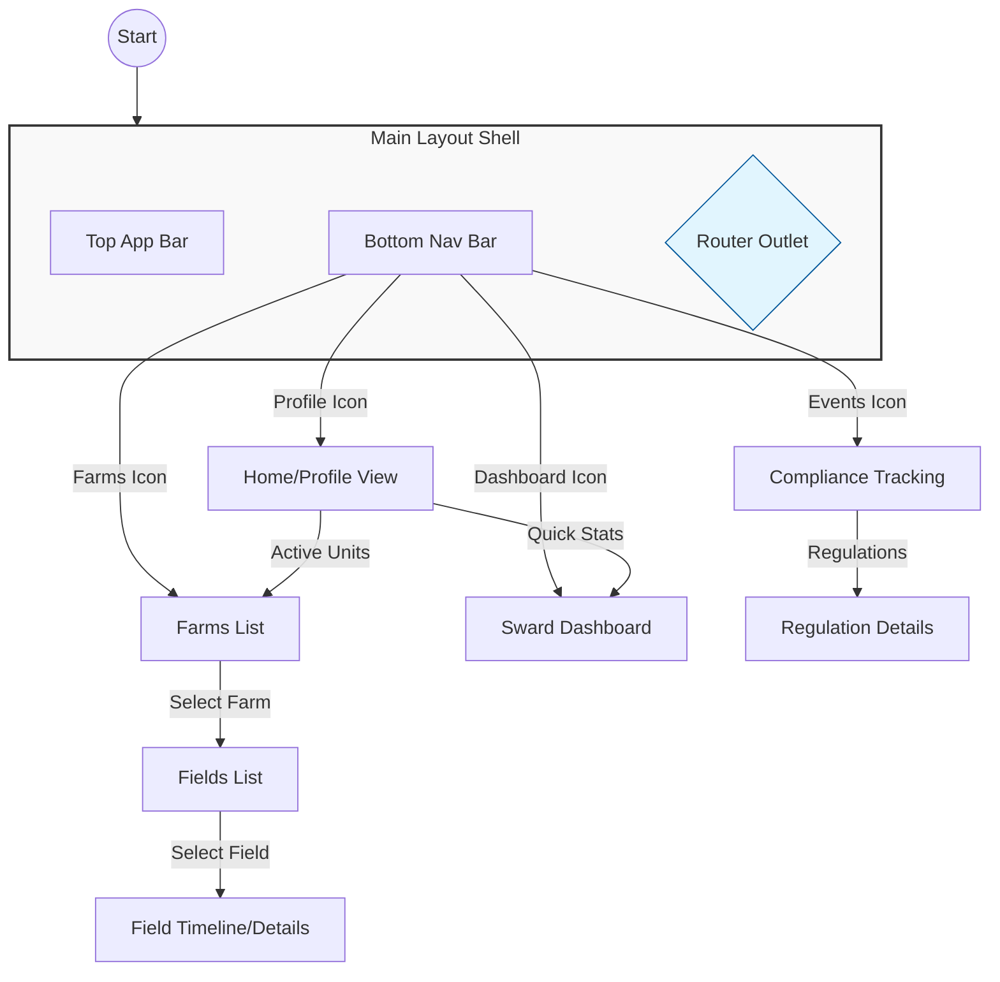

# UI Analysis and Enhancement Plan

## 1. Current State Assessment

### High-Quality UI Elements
The following components have already been implemented with a premium, high-quality aesthetic using Tailwind CSS, custom HSL color palettes, and Google Fonts (Work Sans):
- **HomeComponent (Profile)**: Features a premium hero section, Bento-style stats, and interactive farm cards.
- **FarmsComponent**: Clean grid layout with cinematic imagery and clear operational stats.
- **FieldsComponent**: Modern search/filter interface with minimalist field cards.
- **FieldViewComponent**: Detailed timeline view with high-quality icons and clear typography.

### Basic/Missing High-Quality Elements
The following modules are currently implemented using basic HTML, standard Angular Material components, or simple Tailwind placeholders. They lack the premium "FieldMetric" aesthetic:
- **SwardDashboardComponent**: Basic Material cards and progress bars.
- **ComplianceTrackingComponent**: Standard Material lists for alerts and regulations.
- **OptimizationEngineComponent**: Simple list-based layout.
- **WeatherIntegrationComponent**: Basic card-based weather display.
- **TopologyMappingComponent**: List-based risk assessment.
- **UserProfileComponent**: Very basic HTML form.
- **WaterwayProtectionComponent**: Basic utility module.
- **Inventory & Equipment Module**: Current implementation is a set of simple list-based forms and cards.
- **Reporting & Export Module**: Current implementation uses basic cards for navigation and simple lists for reports.

## 2. High-Fi Implementation Requirements

For each missing section, the following pages and descriptions outline the expected high-fidelity implementation:

### 2.1 Sward Management Dashboard
- **Page Name**: `SwardDashboardComponent`
- **Description**: A "Command Center" for farm nutrients. Should feature:
  - **Dynamic Gauges**: Visual circular gauges showing storage capacity for different manure types (General vs. Pig/Poultry).
  - **Bento Grid Layout**: Information organized into high-contrast tiles with micro-animations on hover.
  - **Nutrient Balance Overview**: A visual summary of N-P-K levels across the farm.
  - **Trend Charts**: Smooth, line charts showing storage levels over the last 6 months.

### 2.2 Compliance & Regulatory Hub
- **Page Name**: `ComplianceTrackingComponent`
- **Description**: A mission-critical status center.
  - **Regulatory Health Score**: A large, premium score (0-100) indicating overall farm compliance.
  - **High-Contrast Alert Cards**: Severity-coded cards (Red for Prohibited, Amber for Warning) with blurred glass backgrounds and crisp icons.
  - **Interactive Regulation Timeline**: A vertical timeline showing upcoming deadlines (e.g., closed periods starting/ending).

### 2.3 Optimization Engine (Smart Recommendations)
- **Page Name**: `OptimizationEngineComponent`
- **Description**: An AI-driven advisor view.
  - **Impact Cards**: Recommendations styled as "Insights" (e.g., "Apply Sward to North Field now to save £200 on Chemical Fertiliser").
  - **Scenario Comparison**: A side-by-side view showing the "Current Plan" vs. "Optimized Plan" with projected nutrient uptake.
  - **Pill-based Action Items**: Quick-action buttons to "Apply Recommendation" with smooth transitions.

### 2.4 Inventory & Equipment Center
- **Page Name**: `InventoryAndEquipmentComponent` (and sub-pages)
- **Description**:
  - **Digital Storage Tank**: (Sub-page: `StorageCapacity`) A 3D-effect or high-quality SVG representation of sward tanks showing actual vs. required capacity (22/26 week markers).
  - **Pesticide Cabinet**: (Sub-page: `ChemicalPesticideInventory`) A "grid of products" view featuring MAPP numbers, expiration countdowns, and "Low Stock" visual indicators.
  - **Fleet Manager**: (Sub-page: `EquipmentTracking`) High-quality cards for tractors/spreaders with "Service Due" badges and LESSE compliance toggles.

### 2.5 Reporting & Export Center
- **Page Name**: `ReportingAndExportComponent` (and sub-pages)
- **Description**:
  - **Document Vault Aesthetic**: A clean, organized library of "Ready for Export" documents.
  - **Validation Checklist**: A visual sidebar showing what data is missing before a report (e.g., Annual Fertilisation Account) can be exported to NIEA.
  - **Live Preview Mode**: A high-fidelity PDF-style preview inside the browser with zoom and search.

### 2.6 User & Farm Profile
- **Page Name**: `UserProfileComponent`
- **Description**:
  - **Farm Identity Header**: Large, cinematic cover photo of the farm with the farm name in heavy, premium typography.
  - **Subscription & Billing**: A "Status" card with glassmorphism, showing active modules and renewal dates.
  - **Employee/Member Management**: An interactive list of people with access, featuring rounded avatars and permission badges.

### 2.7 Environmental Risk & Weather
- **Page Name**: `WeatherIntegrationComponent` / `TopologyMappingComponent`
- **Description**:
  - **Application Window Forecast**: A high-fidelity weather strip that explicitly labels days as "Spreading Permitted" or "Spreading Prohibited" based on rainfall and wind.
  - **Risk Heatmap**: (Sub-page: `WaterwayProtection`) A visual "Risk Map" with color-coded zones (Red for buffer zones, Green for safe application areas).

## 3. Router Outlet Strategy

### The Problem
The current application uses a flat routing structure where every component independently defines its own `TopAppBar` and `BottomNavBar`. This leads to:
- **Code Duplication**: Navigation logic and styles are repeated across multiple files.
- **Layout Jitter**: The UI re-renders the entire shell on every navigation, causing "flickering" of fixed elements like the bottom nav.
- **Maintenance Difficulty**: Global UI changes require updating every component.

### The Solution: Main Layout Shell
We should introduce a `MainLayoutComponent` that acts as a persistent shell for the application.

#### Proposed Structure:
1. **MainLayoutComponent**:
   - Contains the `<header>` (TopAppBar) and `<nav>` (BottomNavBar).
   - Uses a `<main>` section with a `<router-outlet>` to render child content.
   - Handles the "Active State" of navigation items globally.

2. **Nested Routing**:
   Update `app.routes.ts` to nest feature routes under the `MainLayoutComponent`.

```typescript
export const routes: Routes = [
  {
    path: '',
    component: MainLayoutComponent,
    children: [
      { path: 'home', component: HomeComponent },
      { path: 'farms', component: FarmsComponent },
      { path: 'farms/:farmId/fields', component: FieldsComponent },
      { path: 'fields/:fieldId', component: FieldViewComponent },
      { path: 'dashboard', component: SwardDashboardComponent },
      { path: 'compliance', component: ComplianceTrackingComponent },
      { path: 'inventory-and-equipment', component: InventoryAndEquipmentComponent },
      { path: 'reporting-and-export', component: ReportingAndExportComponent },
      { path: 'profile', component: UserProfileComponent },
      { path: '', redirectTo: 'home', pathMatch: 'full' }
    ]
  }
];
```

## 4. Application Flow Diagram



## 5. UI Design Recommendations

To achieve a "more elegant UI" across the entire app, we should:

1. **Standardize Components**: Create reusable high-quality components for:
   - **BentoCards**: For dashboard stats and quick info.
   - **ActionButtons**: Standardizing the premium "pill" buttons used in FieldView.
   - **TimelineItems**: Standardizing the activity tracking look.
2. **Upgrade Basic Modules**:
   - **Dashboard**: Redesign using the Bento grid pattern found in `HomeComponent`.
   - **Compliance**: Use the high-quality icon/card style for alerts.
   - **User Profile**: Move the onboarding/profile editing to match the premium "Arthur Miller" profile look.
3. **Motion Design**:
   - Implement `BrowserAnimationsModule` to add smooth transitions between `router-outlet` states.
   - Add micro-animations (scale-95 on active, hover transitions) to all interactive elements globally via the MainLayout.
