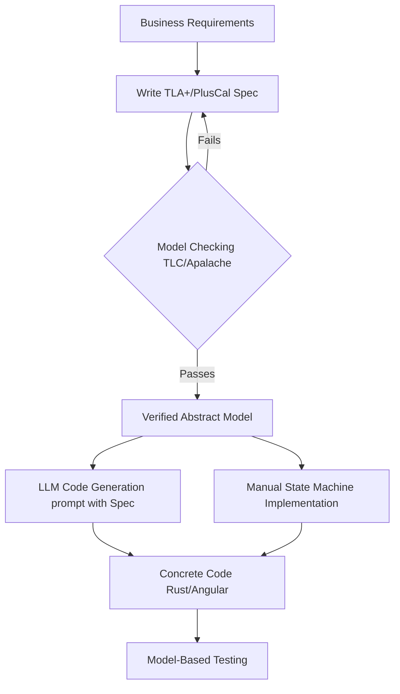
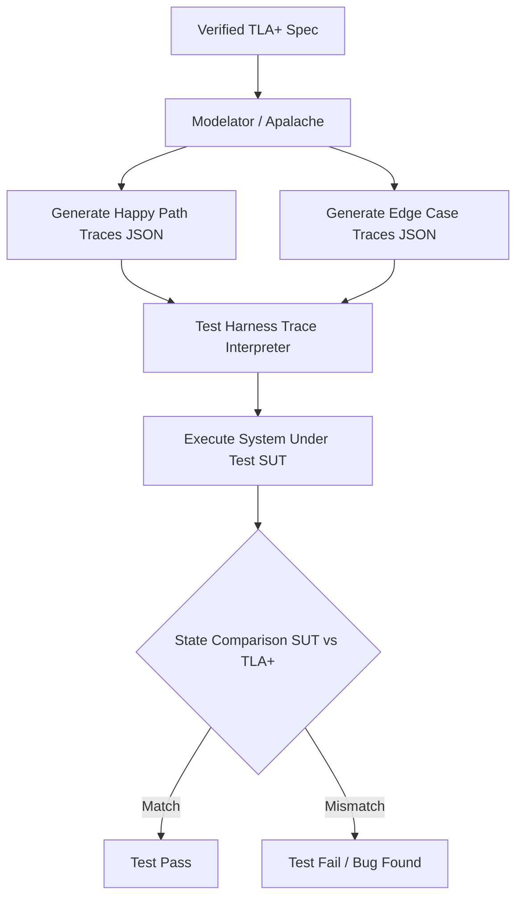

# PRD 0016: Formal Verification and Model-Based Testing (MBT)

## 1. Overview
As the system evolves to include highly complex, fault-intolerant logic (e.g., distributed state transitions, consistency requirements, spatial optimizations), we require rigorous methods to ensure correctness. This document explores the integration of **TLA+** (Temporal Logic of Actions) and **Model-Based Testing (MBT)** into our engineering lifecycle. It establishes a pathway from formal specifications to production code, and from models to automated test suites.

## 2. Goals
1. **Model to Implementation Pipeline**: Establish a clear, verifiable pathway from a validated TLA+ specification to application code (Rust/Angular) while maintaining behavioral guarantees.
2. **Model-Based Testing**: Automatically generate exhaustive test suites (both happy and negative paths) from the formal model to verify that the implementation adheres to the contractual interfaces defined in the specification.
3. **Traceability**: Ensure that derived implementations and test cases remain directly traceable back to the TLA+ models.

---

## 3. Direction 1: Towards the Implementation

### 3.1 The Gap Between TLA+ and Code
TLA+ is a design-level specification language. It verifies abstract algorithms, not the concrete code. Generating production code (e.g., Rust) directly from TLA+ is generally infeasible due to operational specifics (I/O, memory management, network stacks).

### 3.2 Proposed Workflow: AI-Assisted Implementation & Refinement
To bridge the gap, we adopt a **Specification-Driven Development** approach, utilizing TLA+ as an executable contract for implementation:

1. **Formalize in TLA+ / PlusCal**: Engineers author the algorithm in TLA+ or PlusCal, defining the exact state machine, invariants (safety properties), and temporal properties (liveness).
2. **Model Checking (TLC/Apalache)**: The model is checked against all possible interleavings to ensure no design flaws exist.
3. **AI-Assisted Code Generation**: The validated TLA+ specification, alongside clear contextual prompts, is provided to LLMs. Because TLA+ eliminates ambiguity and defines all edge cases upfront, the LLM can generate highly accurate, target-language code (e.g., Rust actors, state machines).
4. **State Machine Mapping**: Implement the logic using strict state machine libraries (e.g., `statig` in Rust or `XState` in Angular) that conceptually mirror the TLA+ transitions line-by-line.

### 3.3 Prototype Concept: PlusCal to Rust
To illustrate this approach, consider a simple inventory logic where a silo can be filled, but not beyond its maximum capacity.

**1. The PlusCal Model:**
```tla
--algorithm SiloInventory {
    variables
        current_volume = 0,
        max_capacity = 100;

    process (FillSilo = 1)
    variable amount \in 1..50;
    {
    Fill:
        if (current_volume + amount <= max_capacity) {
            current_volume := current_volume + amount;
        } else {
            \* Reject filling beyond capacity
            skip;
        }
    }
}
```

**2. The Target Rust Implementation:**
Using the TLA+ definition, an LLM or developer clearly maps the states and invariants to Rust code.

```rust
struct Silo {
    current_volume: u32,
    max_capacity: u32,
}

impl Silo {
    /// Attempts to fill the silo.
    /// Returns Ok if successful, Err if the fill would exceed max capacity.
    fn fill(&mut self, amount: u32) -> Result<(), &'static str> {
        if self.current_volume + amount <= self.max_capacity {
            self.current_volume += amount;
            Ok(())
        } else {
            // Equivalent to `skip` in TLA+, rejecting the state change.
            Err("Cannot exceed max capacity")
        }
    }
}
```

### 3.4 Implementation Workflow Diagram



---

## 4. Direction 2: Model-Based Testing (MBT)

To guarantee the concrete implementation respects the formal model, we generate test cases directly from the TLA+ specifications.

### 4.1 Trace Generation via Apalache / Modelator
We will utilize tools like **Apalache** (a symbolic model checker for TLA+) and **Modelator** to extract execution traces:
1. **Happy Paths**: Generate valid execution traces that satisfy a given behavior.
2. **Negative Paths / Edge Cases**: Instruct the model checker to find edge cases or "counterexamples" by temporarily negating invariants, producing traces that lead to boundary conditions.

### 4.2 Test Execution Pipeline
1. **Trace Extraction**: Modelator exports traces as structured data (e.g., JSON), representing sequential states and the actions that transition between them.
2. **Trace Interpretation (Harness)**: We build test harnesses (in Rust for backend, or Robot Framework for E2E) that interpret these traces.
3. **Execution**: The harness maps the abstract TLA+ state variables to concrete application states, executes the corresponding API/interface calls, and asserts that the application's post-state matches the TLA+ post-state.

### 4.3 Prototype Concept: Traces to Test Harness

Using the `SiloInventory` example, `Modelator` generates an execution trace where a system tries to fill a silo.

**1. Generated JSON Trace (Abstract State):**
```json
{
  "states": [
    { "step": 1, "action": "Init", "current_volume": 0, "max_capacity": 100 },
    { "step": 2, "action": "FillSilo", "amount_passed": 60, "current_volume": 60, "max_capacity": 100 },
    { "step": 3, "action": "FillSilo", "amount_passed": 50, "current_volume": 60, "max_capacity": 100 }
  ]
}
```
*(Note in step 3, the `current_volume` remained 60 because 60 + 50 > 100, fulfilling the safety constraint).*

**2. Rust Trace Interpreter (Harness):**
A test harness parses this JSON and dynamically calls the system interfaces.

```rust
#[test]
fn test_silo_traces() {
    let trace: Trace = load_trace("silo_trace.json");
    let mut silo = Silo { current_volume: 0, max_capacity: 100 }; // Init state

    for state in trace.states.iter().skip(1) { // Skip Init
        if state.action == "FillSilo" {
            // Execute the system under test (SUT)
            let _ = silo.fill(state.amount_passed);

            // Assert that the Concrete SUT State matches the Abstract TLA+ Post-State
            assert_eq!(silo.current_volume, state.current_volume);
        }
    }
}
```

### 4.4 MBT Workflow Diagram



---

## 5. Alternatives to TLA+

While TLA+ is the industry standard for verifying distributed systems, its disconnect from executable code introduces friction. We should consider the following alternatives depending on the specific subsystem requirements:

### 5.1 P Language
- **What it is**: A state-machine-based programming language developed by Amazon and Microsoft for modeling and specifying complex distributed systems.
- **Why use it**: P models can be rigorously model-checked, and importantly, **compiled directly to executable code** (C/C++). This eliminates the gap between model and implementation.
- **Use Case**: Highly asynchronous, event-driven subsystems where generating C/Rust FFI bindings is acceptable.

### 5.2 Dafny
- **What it is**: A verification-aware programming language backed by Microsoft Research. It requires programmers to write pre-conditions, post-conditions, and loop invariants alongside the code.
- **Why use it**: It mathematically proves the code compiles and adheres to the specifications before it can be run. It compiles to C#, Java, JavaScript, and Go.
- **Use Case**: Critical algorithms (e.g., spatial optimizations, cryptography) where mathematical certainty of the implementation is required, and compilation to a target language (like Go/JS) is acceptable.

### 5.3 Rust-Native Verification (Prusti / Creusot / Kani)
- **What it is**: Tools that bring formal verification directly into the Rust ecosystem.
  - **Prusti / Creusot**: Deductive verifiers for Rust. You write contracts (pre/post-conditions) in Rust macros, and it proves them.
  - **Kani**: A bit-precise model checker for Rust that verifies properties using bounded model checking.
- **Why use it**: Allows us to keep all logic natively within Rust while proving functional correctness, avoiding the need for a separate modeling language like TLA+.
- **Use Case**: Proving the safety and correctness of critical Rust backend modules without stepping outside the Rust ecosystem.

## 6. Summary and Recommendation
For distributed system architectures and macroscopic state changes, **TLA+ coupled with Modelator/Apalache for Model-Based Testing** is the recommended path. It treats the backend as a black box and validates the contractual interfaces.

For microscopic, highly complex algorithmic logic confined within the backend, leveraging **Rust-Native Verification (Kani / Creusot)** is recommended to maintain developer velocity while achieving mathematical certainty.
