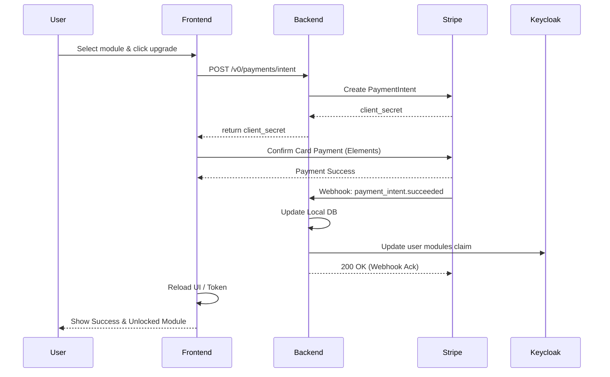
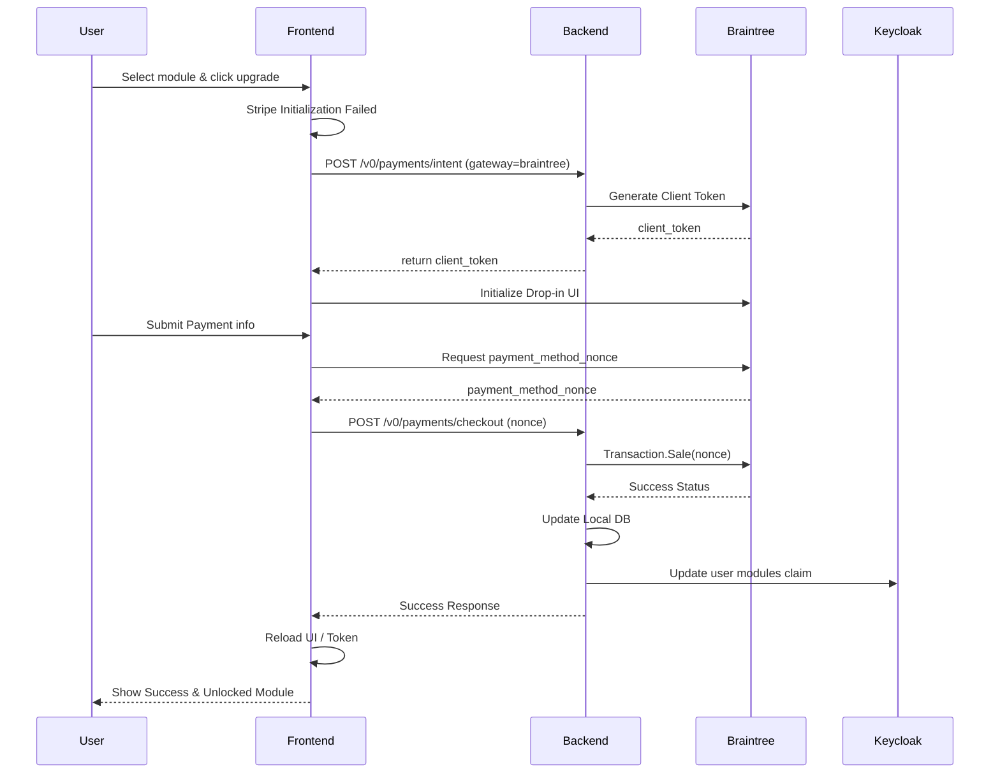

# PRD 0017: Payments and Subscriptions

## Overview
This document outlines the requirements and design choices for integrating a payment system into the application. The goal is to allow users on the minimal (free) tier to purchase upgrades (modules) that grant access to specific features for a set duration (e.g., 3 months, 1 year). To ensure reliability and fallback capability, the system will support at least two credit card payment gateway providers.

## 1. Objectives
- Enable users to purchase time-bound module upgrades using credit cards.
- Support multiple payment gateways (Primary and Fallback) to provide redundancy in the event of an outage.
- Restrict module access based on expiration dates.
- Keep payment processing secure and PCI compliant.

## 2. Payment Gateway Research & Selection
To meet the requirement of having two payment providers for fallback, the following top providers have been evaluated based on their developer experience, subscription capabilities, and broad credit card support:

### Stripe (Proposed Primary Gateway)
- **Pros:** Excellent developer experience, robust API, extensive documentation, built-in subscription and one-time payment logic. Stripe Elements provide highly customizable and PCI-compliant frontend UI components.
- **Cons:** While highly modular, setting up the entire billing stack can sometimes be complex if only simple one-off charges are needed.

### Braintree by PayPal (Proposed Secondary/Fallback Gateway)
- **Pros:** Strong support for credit cards, digital wallets, and native PayPal/Venmo integration. Offers a Drop-in UI which is easy to integrate. Proven reliability as a backup option.
- **Cons:** Developer tooling is slightly less modular compared to Stripe; however, it serves excellently as a flexible gateway.

### Recommendation
Use **Stripe** as the primary payment processor for its superior developer tools and subscription management, and implement **Braintree** as a fallback to ensure transactions can still be processed if Stripe experiences an outage.

To ensure the fallback system is continuously validated in production, **10% of checkout traffic will be deliberately routed to Braintree**.
- If a transaction routed to Stripe (90%) fails due to a gateway error, it will fall back to Braintree.
- If a transaction routed to Braintree (10%) fails due to a gateway error, it will fall back to Stripe.

## 3. Flows and Architecture

### Primary Payment Flow (Stripe)



### Fallback Payment Flow (Braintree)



## 4. Design Choices to Resolve
Before implementing the code, the following design decisions must be finalized:

- **Purchase Model: Auto-Renewal vs. One-Off Time-Bound Purchases**
  - *Option A:* Subscriptions that automatically renew at the end of the term (e.g., 3 months, 1 year) requiring vaulting of payment methods.
  - *Option B:* One-off purchases that grant access for a fixed duration, requiring the user to manually repurchase when the term expires. (Simpler initial implementation, avoids complex cancellation flows).
- **Payment Gateway Traffic Routing & Abstraction**
  - *Option A:* Backend determines the active gateway (90% Stripe, 10% Braintree) during the `POST /v0/payments/intent` call and returns the specific gateway to the frontend, which renders the corresponding UI. The frontend automatically requests the other gateway if the first fails to initialize.
  - *Option B:* The frontend determines the 10% split locally and requests the appropriate gateway from the backend.
- **Handling Module Expiration**
  - *Option A:* A background cron job in the backend that daily checks for expired modules and removes the module claims from the database and Keycloak.
  - *Option B:* Real-time evaluation of module expiration dates during authentication and API access checks.

## 5. Backend Requirements
- **Data Models:**
  - Update user/tenant records or create a new `subscriptions` table to track purchased modules, transaction IDs, payment provider used, and expiration dates.
- **API Endpoints:**
  - `POST /v0/payments/intent`: Initialize a payment intent/session, dynamically selecting the active gateway (Stripe or Braintree) based on current system health or configuration.
  - `GET /v0/payments/history`: Retrieve the user's past purchases and current active modules.
- **Webhooks:**
  - Endpoints to receive asynchronous payment success/failure notifications from Stripe and Braintree.
  - Logic to securely verify webhook signatures before processing.
- **Keycloak Synchronization:**
  - Upon successful payment confirmation via webhook, update the local database.
  - Sync the newly acquired module and its expiration date to Keycloak (extending the logic defined in PRD 0013) so that the JWT claims reflect the purchased access.
- **Expiration Management:**
  - Mechanism (e.g., background job) to revoke module access in the database and Keycloak once the purchase duration expires.

## 6. Frontend Requirements
- **Upgrade UI:**
  - A module store or upgrade page where users can view available modules, pricing, and duration options (e.g., 3 months, 1 year).
- **Secure Checkout Components:**
  - Integration of **Stripe Elements** for the primary checkout flow to ensure PCI compliance (sensitive card data is sent directly to Stripe, not our servers).
  - Integration of **Braintree Drop-in UI** as the fallback mechanism.
- **Fallback Logic:**
  - Frontend error handling to detect if the designated payment SDK (Stripe or Braintree) fails to load or initialize, automatically requesting intent for and rendering the alternative component.
- **Subscription Status View:**
  - A section in the user profile or settings page displaying active modules, their expiration dates, and a history of previous transactions.
- **Module Access Gating:**
  - Ensure UI navigation, sidebars, and components appropriately lock or unlock features based on the presence of the purchased module in the user's JWT claims.

## 7. Prototype Concept Examples

### 7.1 Backend API Contract (Intent Generation)

**Request:** `POST /v0/payments/intent`
```json
{
  "module_id": "reports_and_analysis",
  "duration_months": 12
}
```

**Response (Stripe 90% Route):**
```json
{
  "gateway": "stripe",
  "client_secret": "pi_1J4b..._secret_...",
  "amount_pence": 15000,
  "currency": "GBP"
}
```

**Response (Braintree 10% Route / Fallback):**
```json
{
  "gateway": "braintree",
  "client_token": "eyJ2ZXJzaW9uIjoyLCJhdXRob3JpemF0aW9uRmluZ2VycHJpbnQiOi...=",
  "amount_pence": 15000,
  "currency": "GBP"
}
```

### 7.2 Frontend Angular Component Architecture (Conceptual)

```typescript
// PaymentContainerComponent
// Orchestrates the gateway logic and renders the correct child UI

@Component({
  selector: 'app-payment-container',
  template: `
    <div class="checkout-wrapper">
      <h2>Upgrade to {{ moduleName }}</h2>

      <div *ngIf="loading" class="spinner">Loading payment gateway...</div>

      <!-- Rendered if backend assigned Stripe (90% chance) -->
      <app-stripe-checkout
         *ngIf="activeGateway === 'stripe'"
         [clientSecret]="stripeClientSecret"
         (paymentSuccess)="onSuccess($event)"
         (gatewayError)="fallbackToBraintree()">
      </app-stripe-checkout>

      <!-- Rendered if backend assigned Braintree (10% chance) OR if Stripe failed -->
      <app-braintree-checkout
         *ngIf="activeGateway === 'braintree'"
         [clientToken]="braintreeClientToken"
         (paymentSuccess)="onSuccess($event)"
         (gatewayError)="fallbackToStripe()">
      </app-braintree-checkout>
    </div>
  `
})
export class PaymentContainerComponent implements OnInit {
   // Logic to call POST /v0/payments/intent and set activeGateway
}
```

### 7.3 Webhook Event Processing (Concept)

When Stripe confirms a successful payment, the backend webhook handler processes the event:

```json
// Incoming Stripe Webhook Payload (payment_intent.succeeded)
{
  "id": "evt_1J4b...",
  "type": "payment_intent.succeeded",
  "data": {
    "object": {
      "id": "pi_1J4b...",
      "amount": 15000,
      "metadata": {
        "user_id": "ae5245cd-3095-46db-8ce3-cea42fe26edf",
        "module_id": "reports_and_analysis",
        "duration_months": "12"
      }
    }
  }
}
```

The backend receives this, verifies the signature securely, and executes a database transaction to grant the module, before making the Keycloak API call to sync the JWT claims for the user.
